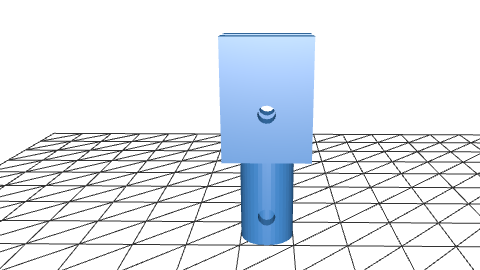
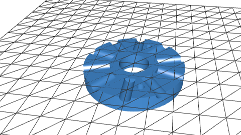

# Kostenlose CAD .stl Modelle für Windrad Projekte !
***Hinweis:***  
Disks Enthält die Mittelscheiben  [Disks](CAD_Models/disks/README.md)  
Holders enthält die Halterungen  [Holder](CAD_Models/Holders/README.md)  
Alle .stl Modelle können in [Tinkercad](https://www.tinkercad.com/) geöffnet werden !  
### Eine Schnelle Vorschau der Modelle
  
  
  
   

> Disclaimer die Modelle sind mit Python numpy-stl und trimesh erstellt, und wurden in tinker cad verbessert 😀 !
